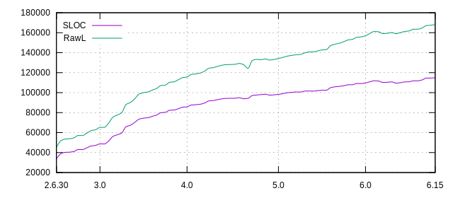
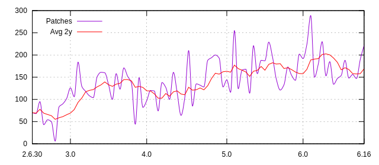

Contributors
============

The following companies contribute to Btrfs code, not counting the treewide and
other subsystem changes. Infrequent contributions are not reflected in this
list, please have a look to the git history for complete list.

Sorted by amount of contributions:

* SUSE
* Facebook
* Western Digital
* Oracle

The following contributed in the past (sorted alphabetically):
Fujitsu, Fusion-IO, Intel, Linux Foundation, Red Hat, STRATO AG.

.. list-table::
   :header-rows: 0

   * - .. figure:: plot-contribs.svg
          :scale: 33%
          :alt: Contributors
          :target: `contributors-contribs`_

          Contributors
     - .. figure:: plot-sloc-lines.svg
          :scale: 33%
          :alt: Lines
          :target: `contributors-lines`_

          Lines
     - .. figure:: plot-patches.svg
          :scale: 33%
          :alt: Patches
          :target: `contributors-patches`_

          Patches

Statistics for 6.x series
-------------------------

.. csv-table::
   :header: "Version", "Contributors", "SLOC", "Raw lines", "Patches", "Diffstat", "Year"
   :align: left

    "6.0", "24", "109726", "156988", "192", "+4248 -3108"
    "6.1", "28", "110850", "159284", "224", "+7738 -5442"
    "6.2", "23", "111898", "161197", "289", "+11693 -9780", 2023
    "6.3", "19", "111615", "160912", "150", "+2824 -3108"
    "6.4", "18", "110224", "159150", "180", "+3118 -4879"
    "6.5", "19", "110377", "159415", "230", "+3193 -2928"
    "6.6", "21", "110785", "160152", "153", "+2648 -1909"
    "6.7", "18", "109562", "159074", "185", "+4376 -5476", 2024
    "6.8", "17", "109963", "160078", "134", "+4494 -3490"
    "6.9", "19", "110727", "161231", "147", "+2476 -1323"
    "6.10", "21", "110878", "161751", "154", "+2993 -2473"
    "6.11", "18", "111848", "163484", "188", "+5776 -4043"
    "6.12", "20", "111881", "163548", "148", "+1868 -1804"
    "6.13", "25", "112756", "164722", "156", "+2780 -1579", 2025
    "6.14", "20", "114592", "167178", "147", "+3847 -1391"
    "6.15", "25", "114616", "167485", "190", "+2346 -2039"
    "6.16", "16", "114997", "168152", "222", "+4143 -3464"
    "6.17", "27", "115015", "168409", "255", "+3082 -2823"

Legend:

-  *Files:* fs/btrfs/\*.[ch], fs/btrfs/tests/\*.[ch], include/uapi/linux/btrfs.h, include/uapi/linux/btrfs_tree.h, include/linux/btrfs.h, include/trace/events/btrfs.h
-  *Version:* mainline version
-  *Contributors:* number of people that sent patches that modified ''Files'', direct btrfs development or originating from other tree-wide changes
-  *SLOC:* lines of code, http://dwheeler.com/sloccount/ (generated by version 2.26)
-  *Raw lines:* counted by ''wc -l'' over ''Files''
-  *Patches:* number of patches from ''Contributors'', merge commits excluded
-  *Diffstat:* lines added and deleted in ''Files''

Statistics for 5.x series
-------------------------

.. csv-table::
   :header: "Version", "Contributors", "SLOC", "Raw lines", "Patches", "Diffstat", "Year"
   :align: left

    "5.0", "15",  "98298", "134159", "144", "+3173 -2297", 2019
    "5.1", "18",  "98992", "135308", "116", "+2208 -1059"
    "5.2", "22",  "99888", "136521", "255", "+3524 -2311"
    "5.3", "20", "100254", "137224", "124", "+4106 -3400"
    "5.4", "18", "100660", "137889", "166", "+10752 -10087"
    "5.5", "17", "100638", "138212", "168", "+3055 -2729", 2020
    "5.6", "18", "101482", "139742", "114", "+3370 -1840"
    "5.7", "22", "101661", "140694", "221", "+4484 -3532"
    "5.8", "21", "101562", "140930", "158", "+3176 -2940"
    "5.9", "18", "101973", "141748", "188", "+2218 -1400"
   "5.10", "22", "102378", "142760", "187", "+3148 -2135"
   "5.11", "15", "102418", "143124", "229", "+4872 -4507", 2021
   "5.12", "20", "105026", "147099", "195", "+5310 -1316"
   "5.13", "19", "105820", "148503", "145", "+3334 -1930"
   "5.14", "19", "106324", "149550", "121", "+2823 -1774"
   "5.15", "17", "106895", "151006", "133", "+2879 -1422"
   "5.16", "24", "107854", "152760", "173", "+4770 -3016", 2022
   "5.17", "17", "107910", "153407", "154", "+4024 -3378"
   "5.18", "30", "109159", "155372", "143", "+3489 -1523"
   "5.19", "21", "109140", "155848", "202", "+4448 -3972"

Statistics for 4.x series
-------------------------

.. csv-table::
   :header: "Version", "Contributors", "SLOC", "Raw lines", "Patches", "Diffstat", "Year"
   :align: left

    "4.0", "22", "85849", "115716",  "97", "+1622 -937"
    "4.1", "25", "87596", "118253", "120", "+2415 -1062"
    "4.2", "19", "87935", "118790", "119", "+2392 -1855"
    "4.3", "23", "88384", "119576",  "74", "+1516 -730"
    "4.4", "26", "89543", "121456", "138", "+3184 -1304", 2016
    "4.5", "26", "91708", "124363", "127", "+4370 -1462"
    "4.6", "29", "92134", "125045", "100", "+1890 -1208"
    "4.7", "33", "92922", "126264", "161", "+3721 -2502"
    "4.8", "22", "93769", "127392", "114", "+2732 -1604"
    "4.9", "25", "94237", "128040",  "64", "+1959 -1311"
   "4.10", "24", "94303", "128156", "105", "+4874 -4758", 2017
   "4.11", "24", "94365", "128340", "210", "+2084 -1900"
   "4.12", "21", "94931", "129230",  "85", "+1803 -913"
   "4.13", "29", "93892", "127970", "135", "+2017 -1607"
   "4.14", "28", "94296", "124346", "132", "+2114 -1520"
   "4.15", "30", "97091", "132221", "128", "+3761 -1795", 2018
   "4.16", "25", "97637", "133305", "188", "+2562 -1481"
   "4.17", "21", "98027", "133003", "194", "+2723 -3024"
   "4.18", "26", "98387", "133667", "200", "+3643 -2979"
   "4.19", "25", "97547", "132655", "193", "+2058 -3070"
   "4.20", "22", "97830", "133283", "128", "+1560 -932"

Statistics for 3.x series
-------------------------

.. csv-table::
   :header: "Version", "Contributors", "SLOC", "Raw lines", "Patches", "Diffstat", "Year"
   :align: left

    "3.0", "25", "48665",  "65192", "126", "+7508 -5175"
    "3.1", "24", "48647",  "65248", "106", "+1762 -1586"
    "3.2", "30", "51574",  "69552", "184", "+6344 -2040", 2012
    "3.3", "27", "56216",  "75485", "129", "+7151 -1218"
    "3.4", "25", "57865",  "77671", "118", "+4597 -2411"
    "3.5", "21", "59683",  "79983", "108", "+3570 -1258"
    "3.6", "25", "65894",  "88123", "104", "+9145 -1005"
    "3.7", "30", "67348",  "90171", "151", "+3802 -1754"
    "3.8", "25", "70289",  "93916", "161", "+5599 -1854", 2013
    "3.9", "29", "73414",  "98602", "160", "+6430 -1242"
   "3.10", "24", "74449",  "99980", "133", "+3529 -2151"
   "3.11", "21", "74875", "100657", "100", "+2538 -1857"
   "3.12", "32", "76265", "102497", "158", "+4373 -2533"
   "3.13", "24", "77532", "104108", "123", "+2741 -1123", 2014
   "3.14", "28", "79879", "107069", "171", "+5290 -2329"
   "3.15", "27", "80308", "107544", "152", "+2389 -1914"
   "3.16", "29", "82292", "110331", "137", "+4361 -1574"
   "3.17", "19", "82625", "110841",  "44", "+1060 -550"
   "3.18", "25", "83910", "112906", "149", "+3696 -1631"
   "3.19", "18", "85420", "115031",  "82", "+2802 -677", 2015

Statistics for 2.6.x series
---------------------------

.. csv-table::
   :header: "Version", "Contributors", "SLOC", "Raw lines", "Patches", "Diffstat", "Year"
   :align: left

   "2.6.29", "43", "33092", "43606", "913", "+43705 -0", 2009-03-23
   "2.6.30", "22", "33838", "45377",  "70", "+4403 -2632"
   "2.6.31", "19", "38825", "51693",  "68", "+9207 -2862"
   "2.6.32", "15", "40211", "53515",  "95", "+4291 -2469"
   "2.6.33", "17", "40408", "53806",  "43", "+1332 -1041", 2010
   "2.6.34", "18", "41100", "54715",  "54", "+1374 -465"
   "2.6.35", "14", "43014", "57082",  "50", "+5230 -2863"
   "2.6.36",  "4", "43016", "57088",   "6", "+39 -33"
   "2.6.37", "17", "44781", "59491",  "83", "+3104 -701", 2011
   "2.6.38", "23", "46573", "61980",  "90", "+3472 -983"
   "2.6.39", "28", "47206", "62859", "102", "+2115 -1236"

Historical notes
----------------

The first commit in Btrfs' recorded history is
`be0e5c097fc206b8 <https://git.kernel.org/linus/be0e5c097fc206b863ce9fe6b3cfd6974b0110f4>`__
from 2007-01-26, which is about kernel v2.6.20.  The code was tracked in git in
directory *fs/btrfs* but in a tree independent from *linux.git*, then merged in
commit `aef8755711a28bb0 <https://git.kernel.org/aef8755711a28bb0ecde7780ae6613fcb62cf6f7>`__
(2008-09-24, v2.6.27-rc7) to expected place in the *linux.git* file hierarchy.
After a
`few <https://git.kernel.org/linus/26ce34a9c47334ff7984769e4661b2f1883594ff>`__
`more <https://git.kernel.org/linus/ae20a6afec1cf21919d97303f2d8b737eac5acc7>`__
`merges <https://git.kernel.org/linus/860a7a0c321ce0267fdb6ebdcd03aa63c5fcb31d>`__
it was finally `merged <https://git.kernel.org/73d59314e6ed268d6f322ae1bdd723b23fa5a4ed>`__
by Linus to the *linux.git* git tree (2009-01-09, v2.6.29-rc1).

Graphs
------

.. _contributors-contribs:

Contributors
^^^^^^^^^^^^

.. _contributors-lines:

Lines of code, raw lines
^^^^^^^^^^^^^^^^^^^^^^^^

.. _contributors-patches:

Patches
^^^^^^^

