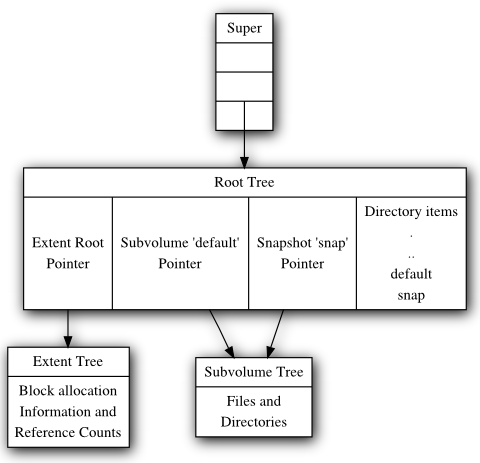

Btrfs design
============

Btrfs is implemented with simple and well known concepts and constructs. The
copy-on-write architecture is based on white paper from Ohad Rodeh (IBM research,
presentation `slides <https://www.usenix.org/event/lsf07/tech/rodeh.pdf>`__,
2006 article `B-trees, shadowing, and clones <https://dl.acm.org/doi/10.1145/1326542.1326544>`__).

Btree data structures
---------------------

The Btrfs btree provides a generic facility to store a variety of data
types. Internally it only knows about three data structures: keys,
items, and a block header:

.. code-block:: none

   struct btrfs_header {
           u8 csum[32];
           u8 fsid[16];
           __le64 bytenr;
           __le64 flags;

           u8 chunk_tree_uid[16];
           __le64 generation;
           __le64 owner;
           __le32 nritems;
           u8 level;
   }

.. code-block:: none

   struct btrfs_disk_key {
          __le64 objectid;
          u8 type;
          __le64 offset;
   }

.. code-block:: none

   struct btrfs_item {
          struct btrfs_disk_key key;
          __le32 offset;
          __le32 size;
   }

Upper nodes of the trees contain only [ key, block pointer ] pairs. Tree
leaves are broken up into two sections that grow toward each other.
Leaves have an array of fixed sized items, and an area where item data
are stored. The offset and size fields in the item indicate where in the
leaf the item data can be found. Example:

.. image:: Leaf-structure.png
   :alt: Leaf structure

Item data is of variable size, and various filesystem data structures are
defined as different types of item data. The type field in struct
btrfs_disk_key indicates the type of data stored in the item.

The block header contains a checksum for the block contents, the UUID of
the filesystem that owns the block, the level of the block in the tree,
and the block number where this block is supposed to live. These fields
allow the contents of the metadata to be verified when the data is read.
Everything that points to a btree block also stores the generation field
it expects that block to have. This allows Btrfs to detect phantom or
misplaced writes on the media.

The checksum of the lower node is not stored in the node pointer to simplify
the FS writeback code. The generation number will be known at the time the
block is inserted into the btree, but the checksum is only calculated before
writing the block to disk. Using the generation allows Btrfs to detect phantom
writes without having to find and update the upper node each time the lower
node checksum is updated.

The generation field corresponds to the transaction id that allocated
the block, which enables easy incremental backups and is used by the
copy on write transaction subsystem.

Filesystem data structures
--------------------------

Each object in the filesystem has an objectid, which is allocated
dynamically on creation. A free objectid is simply a hole in the key
space of the filesystem btree; objectids that don't already exist in the
tree. The objectid makes up the most significant bits of the key,
allowing all of the items for a given filesystem object to be logically
grouped together in the btree.

The offset field of the key stores additional information depending on the key
and its associated item.  For file extents, this would be the byte offset of
the start of the extent in the file. The type field stores the item type
information.

Inodes
------

Inodes are stored in struct btrfs_inode_item. Inode items are always the lowest
valued key for a given object, and they store the stat data for files and
directories. The inode structure is relatively small, and does not contain
embedded file data or extended attribute data. These things are stored in other
item types.

Files
-----

Small files that occupy less than one leaf block may be packed into the
btree leaf inside the extent item. In this case the key offset is the byte
offset of the data in the file, and the size field of struct btrfs_item
indicates how much data is stored. The inline file must fit completely to the
extent item, the limit is either *nodesize* or host machine page size.

Larger files are stored in extents. The struct btrfs_file_extent_item
records a generation number for the extent and a [ disk block, disk num
blocks ] pair to record the area of disk corresponding to the file.
Extents also store the logical offset and the number of blocks used by
this extent record into the extent on disk. This allows Btrfs to satisfy
a rewrite into the middle of an extent without having to read the old
file data first. For example, writing 1MB into the middle of a existing
128MB extent may result in three extent records:

``[ old extent: bytes 0-64MB ], [ new extent 1MB ], [ old extent: bytes 65MB – 128MB]``

File data checksums are stored in a dedicated btree in a struct
btrfs_csum_item. The offset of the key corresponds to the byte number of
the extent. The data is checksummed after compression is done and it reflects
the bytes sent to the disk.

A single item may store a number of checksums. struct btrfs_csum_items
are only used for file extents. File data inline in the btree is covered
by the checksum at the start of the btree block.

Directories
-----------

Directories are indexed in two different ways. For filename lookup,
there is an index comprised of keys:

================== ================== ====================
Directory Objectid BTRFS_DIR_ITEM_KEY 64 bit filename hash
================== ================== ====================

The directory hash used is crc32c. Hash collisions are handled.

The second directory index is used by readdir to return data in inode
number order. This more closely resembles the order of blocks on disk
and generally provides better performance for reading data in bulk
(backups, copies, etc). Also, it allows fast checking that a given inode
is linked into a directory when verifying inode link counts. This index
uses an additional set of keys:

================== =================== =====================
Directory Objectid BTRFS_DIR_INDEX_KEY Inode Sequence number
================== =================== =====================

The inode sequence number comes from the directory. It is increased each
time a new file or directory is added.

Reference counted extents
-------------------------

Reference counting is the basis for the snapshotting subsystems. For
every extent allocated to a btree or a file, Btrfs records the number of
references in a struct btrfs_extent_item. The trees that hold these
items also serve as the allocation map for blocks that are in use on the
filesystem. Some trees are not reference counted and are only protected
by a copy on write logging. However, the same type of extent items are
used for all allocated blocks on the disk.

A reasonably comprehensive description of the way that references work
can be found in `this email from Josef
Bacik <http://www.spinics.net/lists/linux-btrfs/msg33415.html>`__.

Extent block groups
-------------------

Extent block groups allow allocator optimizations by breaking the disk up into
chunks of 256MB, 1GiB or more. For each chunk, they record information about
the number of blocks available.

Block groups have a flag that indicates if they are preferred for data or
metadata allocations. At mkfs time the initial set of block groups is created
and more are added on demand depending on the workload. In the special *mixed*
mode a block group can be used both data and metadata, but this cause a lot of
fragmentation due to different sizes and update patterns.

Explicit back references
------------------------

Back references have three main goals:

-  Differentiate between all holders of references to an extent so that
   when a reference is dropped we can make sure it was a valid reference
   before freeing the extent.
-  Provide enough information to quickly find the holders of an extent
   if we notice a given block is corrupted or bad, or it can be used to look up
   files that the block belongs to.
-  Make it easy to migrate blocks for FS shrinking or storage pool
   maintenance. This is actually the same as #2, but with a slightly
   different use case.

File extent backrefs
^^^^^^^^^^^^^^^^^^^^

File extents can be referenced by:

-  Multiple snapshots, subvolumes, or different generations in one
   subvolume
-  Different files inside a single subvolume
-  Different offsets inside a file

Snapshots and subvolumes
------------------------

Subvolume is a named btree that holds files and directories.  They have inodes
inside the tree of tree roots and can have non-root owners and groups.
All of the blocks and file extents inside of subvolumes are reference counted
to allow snapshotting. Up to 2\ :sup:`64` subvolumes may be created on the FS.

Snapshots are identical to subvolumes, but their root block is initially
shared with another subvolume. When the snapshot is taken, the reference
count on the root block is increased, and the copy on write transaction
system ensures changes made in either the snapshot or the source
subvolume are private to that root. Snapshots are writable, and they can
be snapshotted again any number of times. If read only snapshots are
desired, a flag is set and no new writes are allowed.

Btree Roots
-----------

Each Btrfs filesystem consists of a number of tree roots. A freshly
formatted filesystem will have roots for:

-  The tree of tree roots
-  The tree of allocated extents
-  The default subvolume tree

The tree of tree roots records the root block for the extent tree and
the root blocks and names for each subvolume and snapshot tree. As
transactions commit, the root block pointers are updated in this tree to
reference the new roots created by the transaction, and then the new
root block of this tree is recorded in the FS super block.

The tree of tree roots acts as a directory of all the other trees on the
filesystem, and it has directory items recording the names of all
snapshots and subvolumes in the FS. Each snapshot or subvolume has an
objectid in the tree of tree roots, and at least one corresponding
struct btrfs_root_item. Directory items in the tree map names of
snapshots and subvolumes to these root items. Because the root item key
is updated with every transaction commit, the directory items reference
a generation number of (u64)-1, which tells the lookup code to find the
most recent root available.

The extent trees are used to manage allocated space on the devices. The
space available can be divided between a number of extent trees to
reduce lock contention and give different allocation policies to
different block ranges.

The diagram below depicts a collection of tree roots. The super block
points to the root tree, and the root tree points to the extent trees
and subvolumes. The root tree also has a directory to map subvolume
names to struct btrfs_root_items in the root tree. This filesystem has
one subvolume named 'default' (created by mkfs), and one snapshot of
'default' named 'snap' (created by the admin some time later). In this
example, 'default' has not changed since the snapshot was created and so
both point tree to the same root block on disk.

Copy on write logging
---------------------

Data and metadata in Btrfs are protected with copy on write logging
(COW). Once the transaction that allocated the space on disk is
committed, any new writes to that logical address in the file or btree
will go to a newly allocated block, and block pointers in the btrees and
super blocks will be updated to reflect the new location.

Some of the btrfs trees do not use reference counting for their
allocated space. This includes the root tree, and the extent tree. As
blocks are replaced in these trees, the old blocks are freed in the extent
tree. These blocks are not reused for other purposes until the
transaction that freed them commits.

All subvolume (and snapshot) trees are reference counted. When a COW
operation is performed on a btree node, the reference count of all the
blocks it points to is increased by one. For leaves, the reference
counts of any file extents in the leaf are increased by one. When the
transaction commits, a new root pointer is inserted in the root tree for
each new subvolume root. The key used has the form:

====================== =================== ==============
Subvolume inode number BTRFS_ROOT_ITEM_KEY Transaction ID
====================== =================== ==============

The updated btree blocks are all flushed to disk, and then the super
block is updated to point to the new root tree. Once the super block has
been properly written to disk, the transaction is considered complete.
At this time the root tree has two pointers for each subvolume changed
during the transaction. One item points to the new tree and one points
to the tree that existed at the start of the last transaction.

Any time after the commit finishes, the older subvolume root items may
be removed. The reference count on the subvolume root block is lowered
by one. If the reference count reaches zero, the block is freed and the
reference count on any nodes the root points to is lowered by one. If a
tree node or leaf can be freed, it is traversed to free the nodes or
extents below it in the tree in a depth first fashion.

The traversal and freeing of the tree may be done in pieces by inserting
a progress record in the root tree. The progress record indicates the
last key and level touched by the traversal so the current transaction
can commit and the traversal can resume in the next transaction. If the
system crashes before the traversal completes, the progress record is
used to safely delete the root on the next mount.

References
----------

* BTRFS: The Linux B-Tree Filesystem describing the overall concepts and
  architecture, appeared in ACM Transactions on Storage, August 2013. Includes a
  detailed comparison with ZFS. There is a free ACM authorized link, from O.
  Rodeh's [1] page. Otherwise, try IBM Research link

* Original COW B-tree: Source code in C that implements the COW B-tree algorithms
  repository (https://github.com/orodeh/bt). Written by Ohad Rodeh at IBM
  Research in 2006, and released under a BSD license. This is a reference
  implementation, that works in user space.
